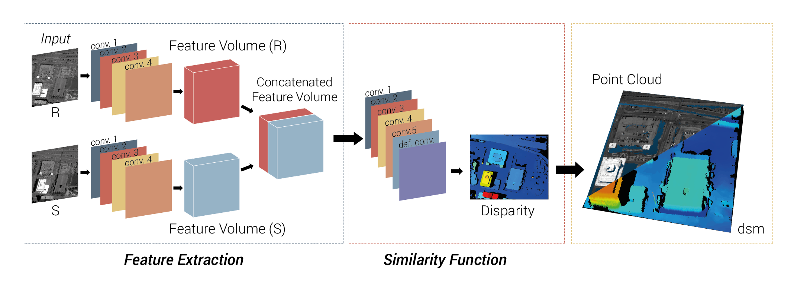
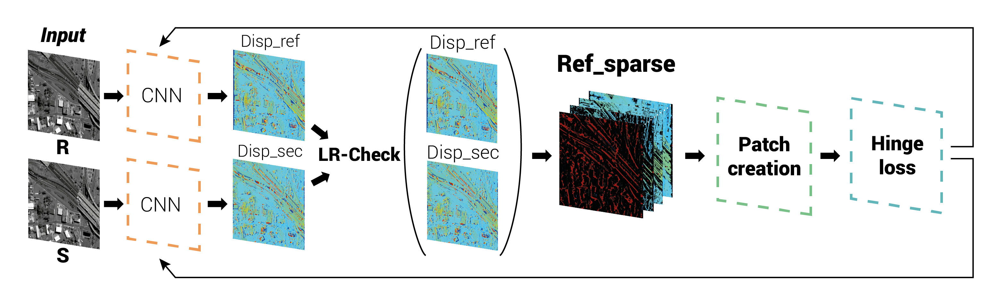
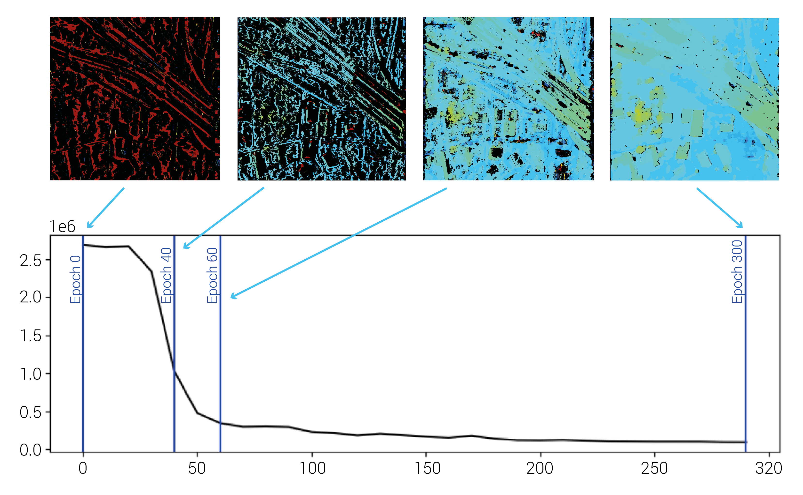

# SAda-Net

### A Self-Supervised Adaptive Stereo Estimation CNN For Remote Sensing Image Data
Dominik Hirner, Friedrich Fraundorfer

A pytorch implementation of our completely self-supervised stereo method for remote sensing image data.
This method has been accepted and will be published at the **ICPR 2024** conference. If you use our work please cite our paper (link later).

Our training routine does not need any annotated ground truth data and is therefore well suited for remote sensing applications, where detailed annotated ground truth data is often missing. We achieve this by introducing a training scheme based on a pseudo ground-truth. This is done by using the initial noisy disparity map as a starting point for training. For robustness noisy/wrong predictions are removed using the left-right consistency check. The so created sparse disparity map is then used as the pseudo ground-truth for training. After each training step this pseudo ground-truth is updated. To track convergence the number of all removed inconsistent point is tracked. 

Our training loop visualized: 

Tracking of inconsistent points visualized: 

The whole project is in python 3 and pytorch 1.8.0 and Cuda 12.4.

This repository contains

- jupyter notebooks for training and inference of disparity via a stereo-pair
- link to our s2p fork with modifications for deep learning matching
- python3.6 code for training and inference
- trained weights for the DFC-2019 contest

## Usage

### Training 

### Inference 
#### Example on Middlebury
## Examples
