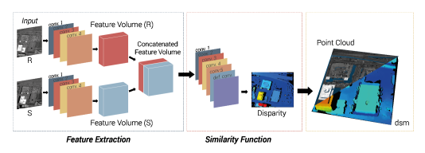

# SAda-Net

### A Self-Supervised Adaptive Stereo Estimation CNN For Remote Sensing Image Data
Dominik Hirner, Friedrich Fraundorfer

A pytorch implementation of our completely self-supervised stereo method for remote sensing image data.
This method has been accepted and will be published at the **ICPR 2024** conference. If you use our work please cite our paper (link later).

The whole project is in python 3 and pytorch X.X.X

This repository contains

- jupyter notebooks for training and inference of disparity via a stereo-pair
- link to our s2p fork with modifications for deep learning matching
- python3.6 code for training and inference
- trained weights for the DFC-2019 contest

## Usage
### Training 
### Inference 
#### Example on Middlebury
## Examples
